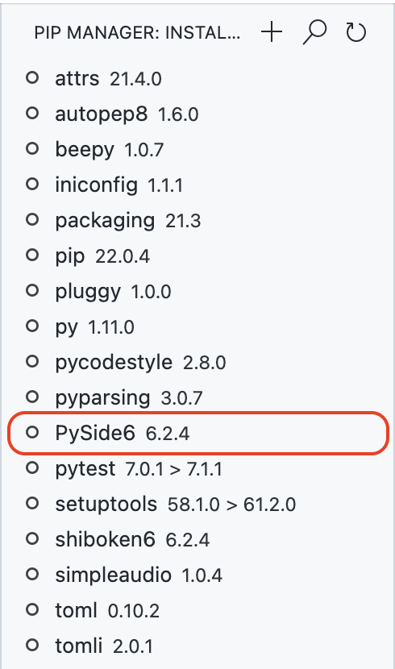
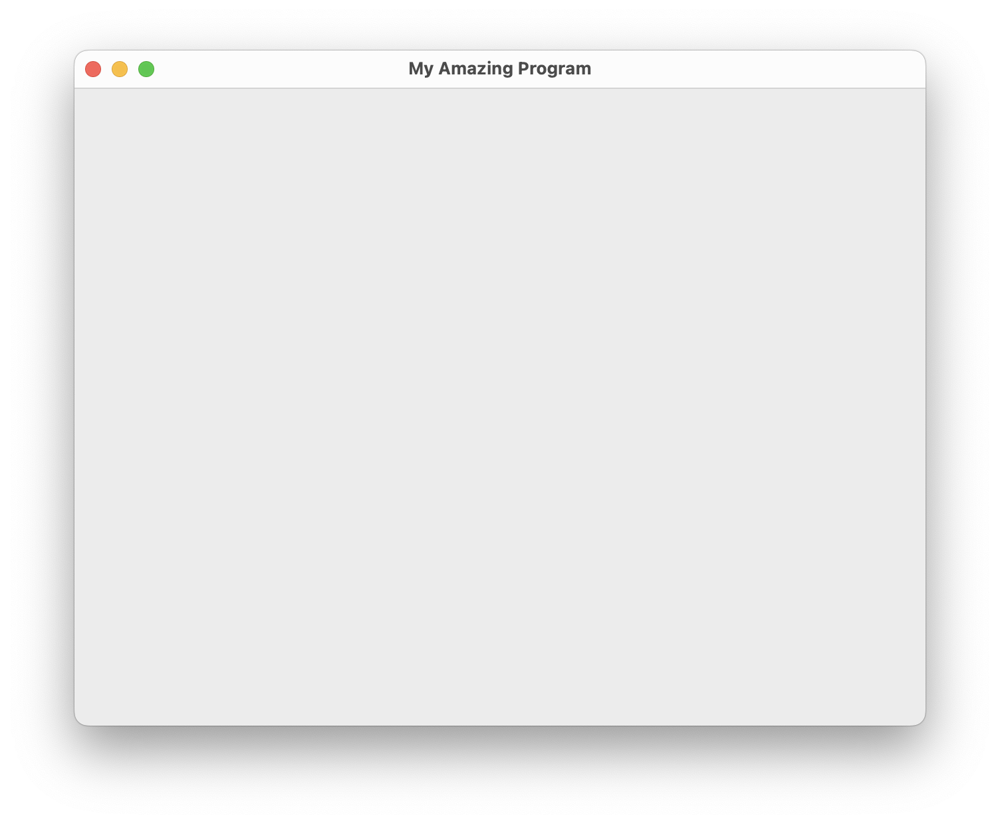
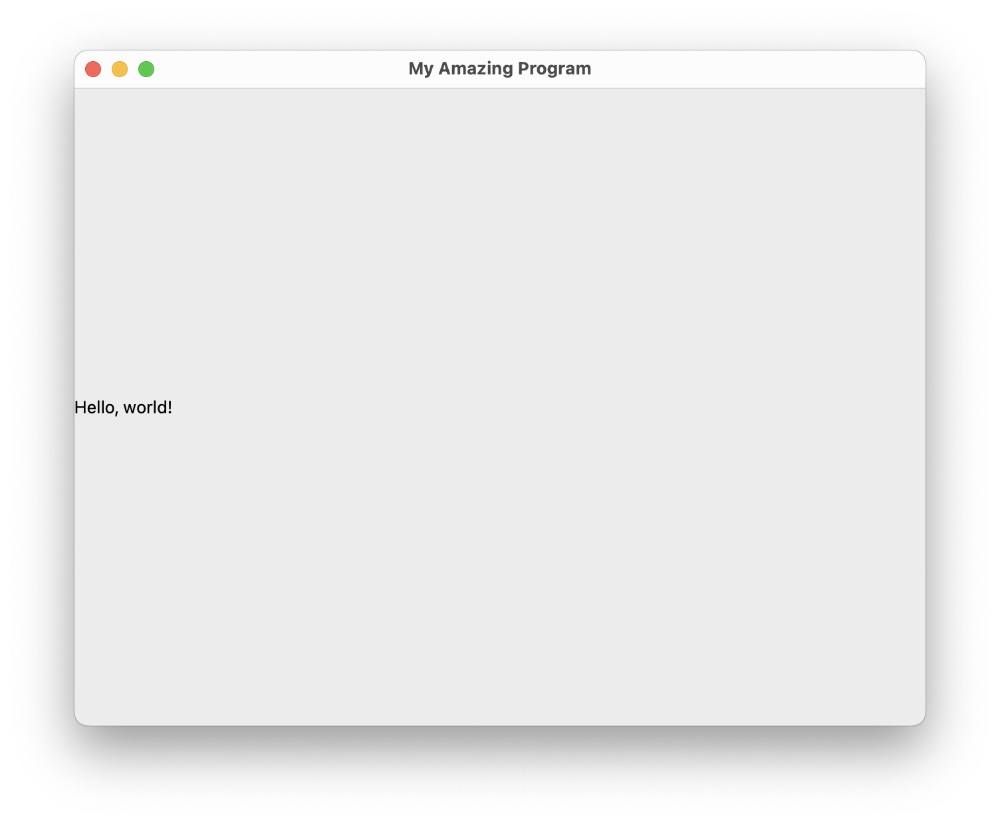

# Graphical user interfaces

At level 3, one of the complex programming techniques you can use is creating a Graphical User Interface (GUI). A GUI allows a program's user to interact with a program with windows, buttons, check boxes, radio buttons, etc.

This also increases the complexity of the program. It's no longer possible to simply print text — you have to manage an interface and update it appropriately in response to user input.

However, things don't have to be scary up front!

Let's start with a basic program that shows a window containing a label.

## Choosing a GUI toolkit

To create a GUI, you need to use a GUI toolkit. This is a library that creates the windows, labels, buttons, etc.

There are many toolkits available, some specific to a certain operating system. For example:

| Windows | macOS | Linux |
| :-- | :-- | :-- |
| Win32 | AppKit | GTK+ |
| Windows Forms | UIKit for Mac | Qt |
| WPF | SwiftUI |
| WinUI |

Some toolkits are available for multiple platforms:

- GTK+
- Qt
- wxWidgets
- tkinter

## Qt

In our class, we will use [**Qt**](https://www.qt.io). This is because Qt can be used on Windows, macOS, and Linux.

Many popular programs are written in Qt, including:

- [Autodesk Maya](https://www.autodesk.com/products/maya/overview)
- [Google Earth](https://www.google.com/earth/versions/)
- [KDE](https://kde.org/)
- [Malwarebytes](https://www.malwarebytes.com/)
- [Musescore](https://musescore.org/)
- [OBS Studio](https://obsproject.com/)
- [VirtualBox](https://www.virtualbox.org/)

Feel free to use a different toolkit if you like. However, you will be responsible for learning how to use it — you may find useful tutorials online. Please consult with your teacher if you plan to use a different toolkit.

# Install Qt support for Python

Follow these steps to install the Qt toolkit and the necessary packages to use Qt in Python:

1. Open Visual Studio Code
2. Click on the Pip Manager tab
3. Click  Add Python Package at the top
4. Type ``PySide6`` in the command palette that appears, and press Enter/Return
5. Wait until you see PySide6 in the list of packages



## Import the PySide6 package

To create an interface with Qt, you will need to import the ``PySide6`` package. As part of this, you should also import the ``sys`` package.

> **Filename**: main.py

```python
import sys
from PySide import QtWidgets
```

## Create a Qt application

The first thing you need in a Qt program is to create a ``QApplication`` object. This tells Python that the program should create a graphical user interface using Qt.

```python
app = QtWidgets.QApplication()
```

## Create a Qt window

Next, you will create a window, give it a title, and set its size. The window will act as a canvas upon which we can add other interface elements, such as labels, buttons, text boxes, etc.

The following code:

1. creates a ``QMainWindow`` object
2. sets the window title (visible in the title bar)
3. resizes the window to a standard size
4. makes the window visible on screen

```python
# Create a QMainWindow object
main_window = QtWidgets.QMainWindow()

# Set the title at the top of the window
main_window.setWindowTitle("My Amazing Program")

# Set the size of the window
main_window.resize(640, 480)

# Display the window
main_window.show()
```



## Add a label widget to the window

To display elements in the window, you need to create more objects. Each object corresponds to a **widget** — the element or control that you want to show or with which a user will interact.

For our purposes, we will create a ``QLabel`` with some text.

```python
# Create a QLabel object
label = QtWidgets.QLabel("Hello, world")

# Add the QLabel widget to the main window
main_window.setCentralWidget(label)
```



## Run the QApplication

Finally, you need to run the ``QApplication`` to make any of the Qt code work.

```python
sys.exec(app)
```

# Task

Instead of a GitHub assignment, I want you to play around with PySide.

Create a new Python file and copy down the following code:

```python
import sys
from PySide6 import QtWidgets

app = QtWidgets.QApplication()

# Create the main window
main_window = QtWidgets.QMainWindow()
main_window.setWindowTitle("My Amazing Program")
main_window.resize(640, 480)
main_window.show()

label = QtWidgets.QLabel("Hello, world!")
main_window.setCentralWidget(label)

sys.exit(app.exec())
```

1. Look through the [QtWidgets documentation](https://doc.qt.io/qtforpython/PySide6/QtWidgets/index.html#module-PySide6.QtWidgets) and see what other kinds of widgets you can add
2. Replace the ``QLabel`` with the following kinds of widgets:
   1. Button
   2. Text field
   3. Spin box
   4. Tab widget
3. Take screenshots of each of these